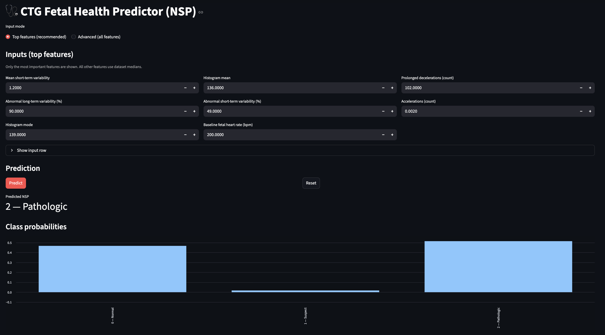
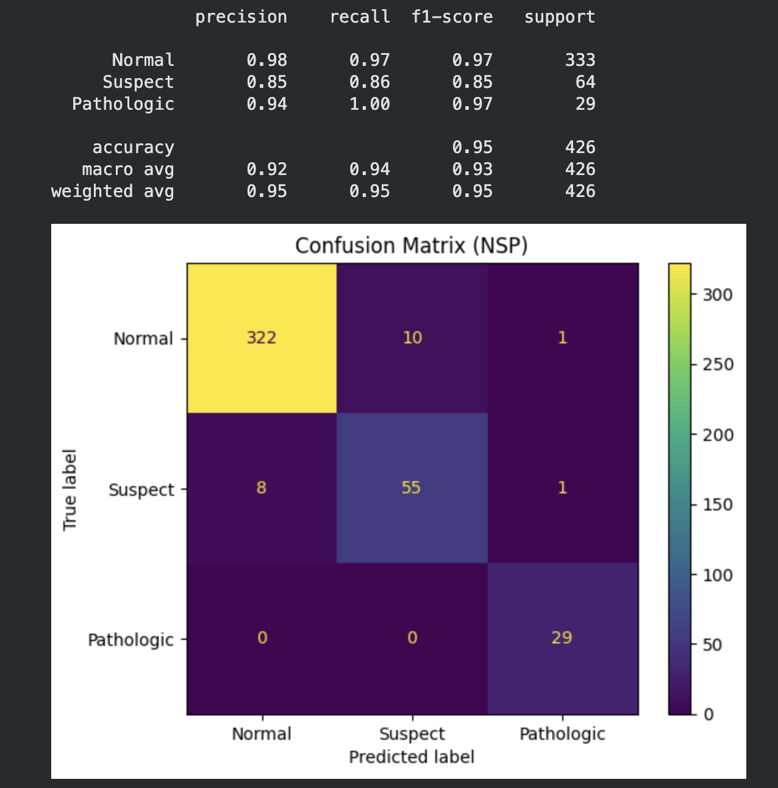

# CTG Fetal Health Predictor (NSP)

Live demo: https://ctg-fetal-health-app-e6qvkm22pim8h8gzvzdyapp.streamlit.app/

A Streamlit web app that predicts fetal health status from Cardiotocography (CTG) features using machine learning.

**Classes (NSP):**
- 0 = Normal
- 1 = Suspect
- 2 = Pathologic

> Disclaimer: Educational project only. Not medical advice.

## Demo


## Models & Results (test set)

| Model | Accuracy | Macro F1 | Normal F1 | Suspect F1 | Pathologic F1 |
|------|----------|----------|-----------|------------|---------------|
| Logistic Regression | 0.88 | 0.78 | 0.94 | 0.65 | 0.76 |
| XGBoost | 0.95 | 0.93 | 0.97 | 0.85 | 0.97 |

**Key takeaway:** XGBoost improves minority-class performance (Suspect/Pathologic), raising macro-F1 from **0.78 → 0.93**.



## How to run locally
```bash
pip install -r requirements.txt
streamlit run app.py
```
## Dataset
Source: UCI Machine Learning Repository — Cardiotocography (CTG) dataset (ID: 193).  
Used for educational purposes.
